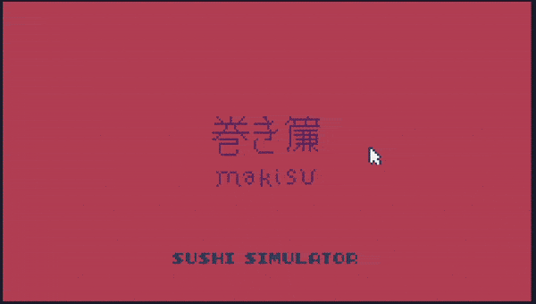
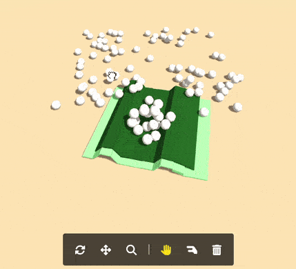

# Makisu: Sushi Making Simulator

## TIC-80 version (2D / 2.5D)

This is a sushi making simulator built in [TIC-80 tiny computer](http://tic80.com/), written in JavaScript.

It uses Verlet integration for point-based physics.

Use the makisu (bamboo mat) to roll and form the sushi.

🕹️ [Play it here](https://1j01.github.io/makisu/tic-80/), or download the [cartridge file](./makisu.tic) and load it in TIC-80.

Features:
- Lovely pixel art for lots of sushi ingredients (not all are used in the game)
- Bowls of ingredients
- You can adjust the 3D effect (oblique projection) freely with the arrow keys, including making it fully 2D if you wish
- Physics are kinda janky but you can technically roll sushi if you're careful
- Secret music (not enabled in the game) imitating Katamari Damacy's theme music

## THREE.js version (3D)

This is a sushi making simulator using [THREE.js](https://threejs.org/), written in JavaScript.

It uses [cannon-es](https://github.com/pmndrs/cannon-es) for physics.

🕹️ [Play it here](https://1j01.github.io/makisu/).

Features:
- Toolbar with camera and interaction tools
- Physics are kinda janky, but you could maybe convince yourself that you've sort of rolled a sushi roll, if you're very careful as well as undiscerning and generous with your imagination
- Grains of rice are just spheres, and fish slices are just boxes that look like damn erasers more than sashimi
- Mobile friendly UI

## Taichi.js version (2D)

This is a prototype, playing around with [taichi.js](https://taichi-js.com/)

They have examples of both 2D and 3D MPM (Material Point Method) simulations.
I've copied from the 2D example and added mouse control and distance constraints,
although it's not working quite as well as I'd like.

I'm not sure exactly how to build on top of MPM "correctly", adding constraints and such.

Also things can explode or disappear when reaching the edges of the screen (possibly due to NaNs or infinities).

🕹️ [Try it here](https://1j01.github.io/makisu/taichi/).

## Development

### TIC-80

Use the [TIC-80](http://tic80.com/) to edit the cartridge file `makisu.tic`.

I've also been keeping track of old versions in `archive/` for some reason.

### Other versions

Any text editor and HTTP server will do.

A custom sushi-inspired theme is included for VS Code.
(It's not currently an extension, it's just defined as overrides in `.vscode/settings.json`.)
